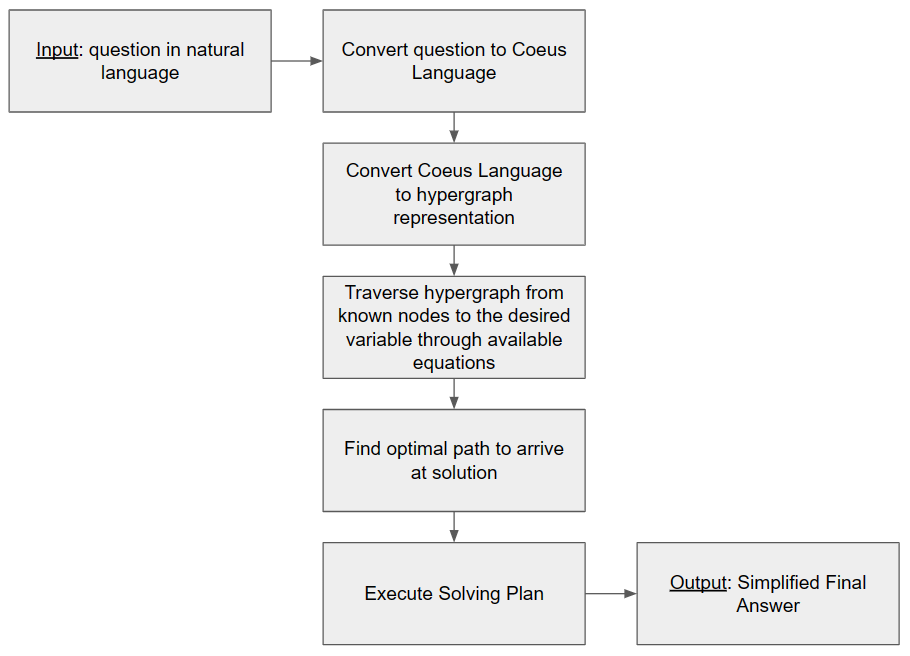
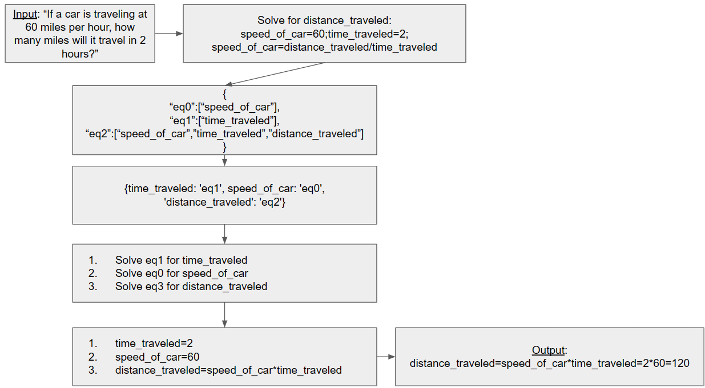

# Coeus

Coeus is designed to answer questions by combining state of the art large language models with efficient math solvers and databases. In this way Coeus can utilize the magical reasoning of LLM's while providing the grounding effect of exact solutions. Notably, Coeus can theoretically use this framework to solve problems that are currently beyond the reach of human knowledge.

Coeus is named after the Greek Titan, who was born of Uranus (sky) and Gaia (earth) and his name translates to "intelligence." This project is inspired by Coeus because we see this project as the development of pure intelligence by combining LLM's (the sky) and math (the ground).

# How Does Coeus Work?
Coeus works by parsing a question in natural language into a format that can be easily understood by a mathematical solver by using an LLM. The LLM is instructed to isolate any variables in the question and provide any relevant formulas to help solve the problem. In this way, we utilize the available latent space to provide context. Once the question is in a standard format, the mathematical solver can go to work. The question is then converted into a hypergraph that can be traversed between nodes. The next step is to use this hypergraph to find a suitable path from known variables to the desired variable. This path is converted into a solving plan, and then sympy is used to execute step in symbolic math. Finally, the final answer is simplified and returned. Below is a flow diagram showing the step.

    </h1>

Below a simple question is passed through this flow to demonstrate how it works.

    </h1>

# Setup
Create a src/config.json file that contains the path to your openai keys. Refer to config_template.json for formatting.

# Usage
You can use Coeus by modifying the script portion of coeus.py by adding your own question.

# Next Steps
The overarching goal of coeus is to solve challenging problems for mankind that have never been solved before. 
To reach that goal, we need to allow all known formulas to be accessed in solving a problem, not just ones deemed relevant by the LLM. Obviously it could miss crucial context.
Therefore, we need to have a database of known formulas, and situations of when they are applicable, and then have the LLM only use variables and formulas that are in that database. In this way, we could allow all known formulas to be at hand for solving a problem, and potentially link things together that have never been done before.
